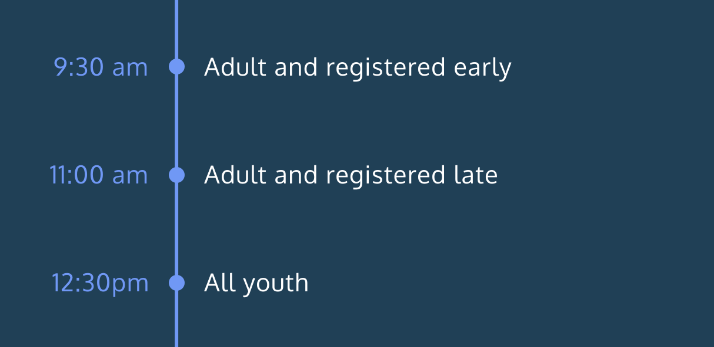

# **Race Day**

The Race Day program creates a race number for the registrant and give them instructions on race day. This training project, prepared by [Codecademy](https://www.codecademy.com/learn/introduction-to-javascript), has been an invaluable exercise in using conditionals using JavaScript.

## Table of Contents

- [Project Prompt](#project-prompt)
- [Technologies](#technologies)
- [Setup](#setup)
- [Sources](#sources)

## Project Prompt

Codecademy’s annual race is just around the corner! This year, we have a lot of participants. You have been hired to write a program that will register runners for the race and give them instructions on race day.

As a timeline, registration would look like this:



Here’s how our registration works. There are adult runners (over 18 years of age) and youth runners (under 18 years of age). They can register early or late. Runners are assigned a race number and start time based on their age and registration.

Race number:

- Early adults receive a race number at or above 1000.
- All others receive a number below 1000.

Start time:

Adult registrants run at 9:30 am or 11:00 am.

- Early adults run at 9:30 am.
- Late adults run at 11:00 am.
- Youth registrants run at 12:30 pm (regardless of registration).

## Technologies

- JavaScript ES6

## Setup

To run this program, you needinstall [Node.js](https://nodejs.org/en/download/) to your machine.

Enter this command to the terminal:

```git
node script.js
```

## Sources

The techniques utilized was based on the lessons taught in [Codecademy's Learn JavaScript Course](https://www.codecademy.com/learn/introduction-to-javascript). The challenge is also provided by Codecademy.
